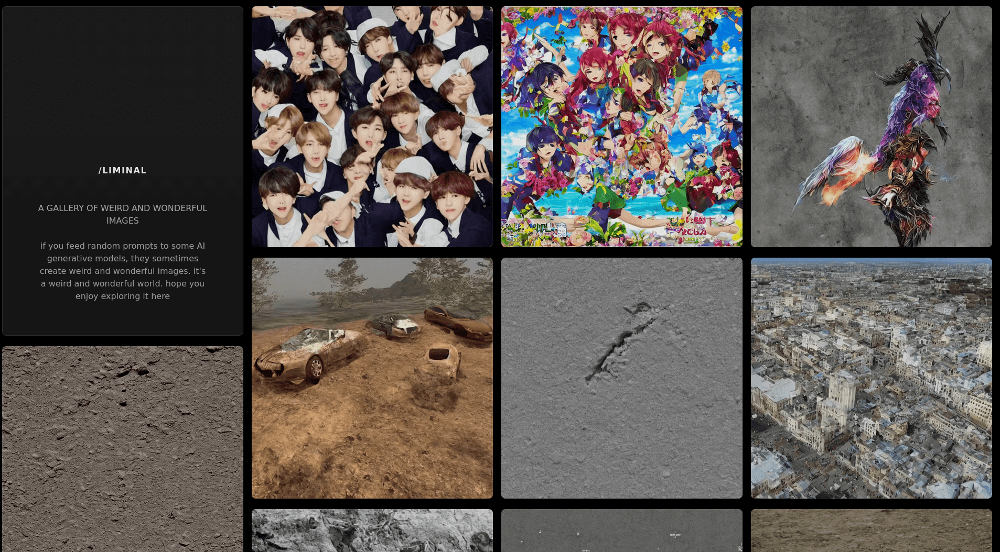

<h1>
    /liminal
</h1>

<h2> <a href=https://liminal-smnai.vercel.app /> A gallery of weird and wonderful images </a> </h2>

<h3>
    What's this?
</h3>

<h4>
    <i>
        A gallery of images generated by feeding a random prompt to Stable Diffusion 2.1
    </i>
</h4>

<h3>
    What do you mean by random?
</h3>

<h4>
    <i>
    I mean a random string of size 1-100, with a random choice of ascii letters, digits and URL-safe punctuation
   </i>
</h4>

<h3>
    Why did you do this?
</h3>

<h4>
    <i>
   Because they look cool
   </i>
</h4>

<h4>
    <i>
    I'm too lazy to code a frontend from scratch, so the page is reusing and modifying <a href="https://vercel.com/templates/next.js/image-gallery-starter"> this project </a>, so all credit to them
   </i>
</h4>

